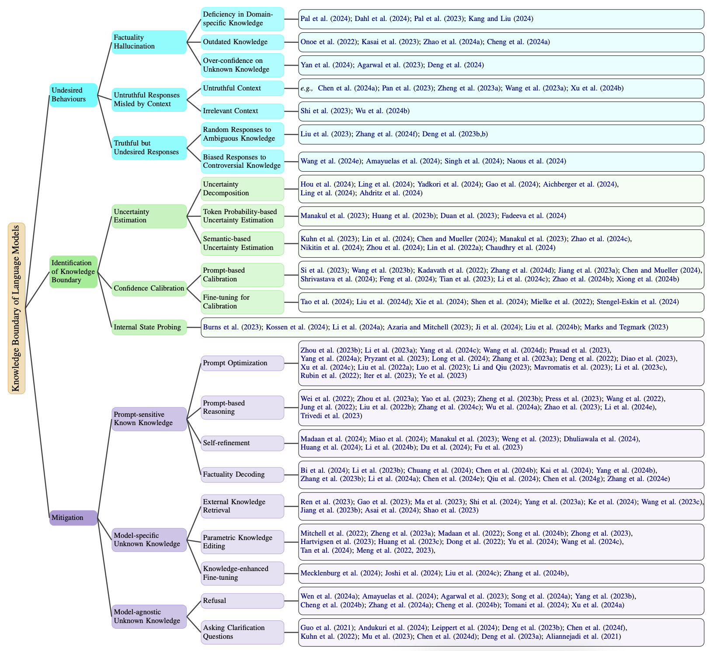

# 💥Knowledge Boundary of Large Language Models: A Survey

This is the repository for the survey paper: [Knowledge Boundary of Large Language Models: A Survey](https://arxiv.org/abs/2412.12472).

  
 The main content flow and categorization of this survey.

## 🚀 Table of Contents
- [Undesired Behaviours](#undesired-behaviours)
  - [Factuality Hallucination](#factuality-hallucination)
    - [Deficiency in Domain-specific Knowledge](#deficiency-in-domain-specific-knowledge)
    - [Outdated Knowledge](#outdated-knowledge)
    - [Over-confidence on Unknown Knowledge](#over-confidence-on-unknown-knowledge)
  - [Untruthful Responses Misled by Context](#untruthful-responses-misled-by-context)
    - [Untruthful Context](#untruthful-context)
    - [Irrelevant Context](#irrelevant-context)
  - [Truthful but Undesired Responses](#truthful-but-undesired-responses)
    - [Random Responses to Ambiguous Knowledge](#random-responses-toambiguous-knowledge)
    - [Biased Responses to Controversial Knowledge](#biased-responses-to-controversial-knowledge)
- [Identification of Knowledge Boundary](#identification-of-knowledge-boundary)
  - [Uncertainty Estimation](#uncertainty-estimation)
    - [Uncertainty Decomposition](#uncertainty-decomposition)
    - [Token Probability-based Uncertainty Estimation](#token-probability-based-uncertainty-estimation)
    - [Semantic-based Uncertainty Estimation](#semantic-based-uncertainty-estimation)
  - [Confidence Calibration](#confidence-calibration)
    - [Prompt-based Calibration](#prompt-based-calibration)
    - [Fine-tuning for Calibration](#Fine-tuning for Calibration)
  - [Internal State Probing](#internal-state-probing)
- [Mitigation](#mitigation)
  - [Prompt-sensitive Known Knowledge](#prompt-sensitive-known-knowledge)
    - [Prompt Optimization](#prompt-optimization)
    - [Prompt-based Reasoning](#prompt-based-reasoning)
    - [Self-refinement](#self-refinement)
    - [Factuality Decoding](#factuality-decoding)
  - [Model-specific Unknown Knowledge](#model-specific-unknown-knowledge)
    - [External Knowledge Retrieval](#external-knowledge-retrieval)
    - [Parametric Knowledge Editing](#parametric-knowledge-editing)
    - [Knowledge-enhanced Fine-tuning](#knowledge-enhanced-fine-tuning)
  - [Model-agnostic Unknown Knowledge](#model-agnostic-unknown-knowledge)
    - [Refusal](#refusal)
    - [Asking Clarification Questions](#asking-clarification-questions)

##  Undesired Behaviours
###  Factuality Hallucination
####  Deficiency in Domain-specific Knowledge
1. A domain-specific next-generation large language model (LLM) or ChatGPT is required for biomedical engineering and research, Pal et al._, **Ann Biomed Eng. 2024**.[[Paper](https://doi.org/10.1007/s10439-023-03306-x)]
2. Large Legal Fictions: Profiling Legal Hallucinations in Large Language Models, Dahl et al._, **Journal of Legal Analysis 2024**.[[Paper](https://arxiv.org/abs/2401.01301)]
3. Med-HALT: Medical Domain Hallucination Test for Large Language Models, Ankit et al._, **CoNLL 2023**.[[Paper](https://doi.org/10.18653/v1/2023.conll-1.21)]
4. Deficiency of Large Language Models in Finance: An Empirical Examination of Hallucination, Haoqiang et al._, **NeurIPS 2023**.[[Paper](https://openreview.net/forum?id=SGiQxu8zFL)]
####  Outdated Knowledge
1. Entity Cloze By Date: What LMs Know About Unseen Entities, Yasumasa et al._, **NAACL 2022**.[[Paper](https://doi.org/10.18653/v1/2022.findings-naacl.52)]
2. RealTime QA: What's the Answer Right Now?, Jungo et al._, **NeurIPS 2023**.[[Paper](http://papers.nips.cc/paper\_files/paper/2023/hash/9941624ef7f867a502732b5154d30cb7-Abstract-Datasets\_and\_Benchmarks.html)]
3. Set the Clock: Temporal Alignment of Pretrained Language Models, Bowen et al._, **ACL 2024**.[[Paper](https://doi.org/10.18653/v1/2024.findings-acl.892)]
4. Dated Data: Tracing Knowledge Cutoffs in Large Language Models, Jeffrey et al._, **COLM 2024**.[[Paper](https://api.semanticscholar.org/CorpusID:268531479)]
####  Over-confidence on Unknown Knowledge
1. Reward-Robust RLHF in LLMs, Yan et al._, **Arxiv 2024**.[[Paper](https://arxiv.org/abs/2409.15360)]
2. Can {NLP} Models 'Identify', 'Distinguish', and 'Justify' Questions
that Don't have a Definitive Answer?, Ayushi et al._, **ACL 2023**.[[Paper](https://doi.org/10.48550/arXiv.2309.04635)]
3. Don't Just Say "I don't know"! Self-aligning Large Language Models
for Responding to Unknown Questions with Explanations, Yang et al._, EMNLP} 2024.[[Paper](https://aclanthology.org/2024.emnlp-main.757)]
###  Untruthful Responses Misled by Context
####  Untruthful Context
1. chen2024editingllmsinjectharm
2. On the Risk of Misinformation Pollution with Large Language Models, Yikang et al._, **EMNLP 2023**.[[Paper](https://doi.org/10.18653/v1/2023.findings-emnlp.97)]
3. Can We Edit Factual Knowledge by In-Context Learning?, Ce et al._, **EMNLP 2023**.[[Paper](https://doi.org/10.18653/v1/2023.emnlp-main.296)]
4. Can ChatGPT Defend its Belief in Truth? Evaluating LLM Reasoning
via Debate, Boshi et al._, **EMNLP 2023**.[[Paper](https://doi.org/10.18653/v1/2023.findings-emnlp.795)]
5. The Earth is Flat because...: Investigating LLMs' Belief towards Misinformation
via Persuasive Conversation, Rongwu et al._, **ACL 2024**.[[Paper](https://doi.org/10.18653/v1/2024.acl-long.858)]
####  Irrelevant Context
1. Large language models can be easily distracted by irrelevant context, Shi et al._, **ICML 2023**.[[Paper](https://arxiv.org/abs/2302.00093)]
2. How Easily do Irrelevant Inputs Skew the Responses of Large Language Models? Siye et al._, **COLM 2024**.[[Paper](https://arxiv.org/pdf/2404.03302)]
###  Truthful but Undesired Responses
####  Random Responses to Ambiguous Knowledge
1. We're Afraid Language Models Aren't Modeling Ambiguity, Alisa et al._, **EMNLP 2023**.[[Paper](https://doi.org/10.18653/v1/2023.emnlp-main.51)]
2. CLAMBER: A Benchmark of Identifying and Clarifying Ambiguous Information
Needs in Large Language Models, Tong et al._, **ACL 2024**.[[Paper](https://doi.org/10.18653/v1/2024.acl-long.578)]
3. Prompting and Evaluating Large Language Models for Proactive Dialogues:
Clarification, Target-guided, and Non-collaboration, Yang et al._, **EMNLP 2023**.[[Paper](https://doi.org/10.18653/v1/2023.findings-emnlp.711)]
4. Prompting and Evaluating Large Language Models for Proactive Dialogues:
Clarification, Target-guided, and Non-collaboration, Yang et al._, **EMNLP 2023**.[[Paper](https://doi.org/10.18653/v1/2023.findings-emnlp.711)]
####  Biased Responses to Controversial Knowledge
1. ControversialQA: Exploring Controversy in Question Answering, Zhen et al._, **LREC/COLING 2024**.[[Paper](https://aclanthology.org/2024.lrec-main.351)]
2. Knowledge of Knowledge: Exploring Known-Unknowns Uncertainty with
Large Language Models, Alfonso et al._, **ACL 2024**.[[Paper](https://doi.org/10.18653/v1/2024.findings-acl.383)]
3. Born With a Silver Spoon? Investigating Socioeconomic Bias in Large Language Models, Smriti et al._, **ArXiv 2024**.[[Paper](https://api.semanticscholar.org/CorpusID:268667484)]
4. Having Beer after Prayer? Measuring Cultural Bias in Large Language
Models, Tarek et al._, **ACL 2024**.[[Paper](https://doi.org/10.18653/v1/2024.acl-long.862)]
##  Identification of Knowledge Boundary
###  Uncertainty Estimation
####  Uncertainty Decomposition
1. Decomposing Uncertainty for Large Language Models through Input Clarification
Ensembling, Bairu et al._, Forty-first International Conference on Machine Learning, **ICML 2024**.[[Paper](https://openreview.net/forum?id=byxXa99PtF)]
2. Uncertainty Quantification for In-Context Learning of Large Language Models, Ling et al._, **NAACL 2024**.[[Paper](https://arxiv.org/abs/2402.10189)]
3. To Believe or Not to Believe Your LLM, Yadkori et al._, **Arxiv 2024**.[[Paper](https://arxiv.org/abs/2406.02543)]
4. SPUQ: Perturbation-Based Uncertainty Quantification for Large Language Models, Gao et al._, **EACL 2024**.[[Paper](https://arxiv.org/abs/2403.02509)]
5. How many Opinions does your {LLM} have? Improving Uncertainty Estimation in {NLG}, Lukas et al._, **ICLR 2024**.[[Paper](https://openreview.net/forum?id=JIIh7OzipV)]
6. Distinguishing the Knowable from the Unknowable with Language Models, Gustaf et al._, **ICML 2024**.[[Paper](https://openreview.net/forum?id=ud4GSrqUKI)]
####  Token Probability-based Uncertainty Estimation
1. SelfCheckGPT: Zero-Resource Black-Box Hallucination Detection for Generative Large Language Models, Manakul et al._, **EMNLP 2023**.[[Paper](https://arxiv.org/abs/2303.08896)]
2. Look before you leap: An exploratory study of uncertainty measurement for large language models, Huang et al._, **IEEE Transactions on Software Engineering 2025**.[[Paper](https://arxiv.org/abs/2307.10236)]
3. Shifting Attention to Relevance: Towards the Uncertainty Estimation of Large Language Models, Jinhao et al._, **CoRR 2023**.[[Paper](https://doi.org/10.48550/arXiv.2307.01379)]
4. Fact-Checking the Output of Large Language Models via Token-Level
Uncertainty Quantification, Ekaterina et al._, **ACL 2024**.[[Paper](https://doi.org/10.18653/v1/2024.findings-acl.558)]
5. Bayesian prompt ensembles: Model uncertainty estimation for black-box large language models, Tonolini et al._, **ACL 2024**.[[Paper](https://aclanthology.org/2024.findings-acl.728/)]
####  Semantic-based Uncertainty Estimation
1. Semantic Uncertainty: Linguistic Invariances for Uncertainty Estimation in Natural Language Generation, Lorenz et al._, **ICLR 2023**.[[Paper](https://openreview.net/forum?id=VD-AYtP0dve)]
2. Generating with Confidence: Uncertainty Quantification for Black-box Large Language Models, Zhen et al._, **Transactions on Machine Learning Research 2024**[[Paper](https://openreview.net/forum?id=DWkJCSxKU5)]
3. Quantifying uncertainty in answers from any language model and enhancing their trustworthiness, Chen et al._, **ACL 2024**.[[Paper](https://aclanthology.org/2024.acl-long.283/)]
4. SelfCheckGPT: Zero-Resource Black-Box Hallucination Detection for Generative Large Language Models, Manakul et al._, **EMNLP 2023**.[[Paper](https://arxiv.org/abs/2303.08896)]
5. Knowing What LLMs {DO} {NOT} Know: {A} Simple Yet Effective Self-Detection
Method, Yukun et al._, **NAACL 2024**.[[Paper](https://doi.org/10.18653/v1/2024.naacl-long.390)]
6. Kernel Language Entropy: Fine-grained Uncertainty Quantification for LLMs from Semantic Similarities, Alexander et al._, **Arxiv 2024**[[Paper](https://arxiv.org/abs/2405.20003)]
7. Relying on the Unreliable: The Impact of Language Models' Reluctance
to Express Uncertainty, Kaitlyn et al._, **ACL 2024**.[[Paper](https://doi.org/10.18653/v1/2024.acl-long.198)]
8. Teaching Models to Express Their Uncertainty in Words, Stephanie et al._, **Trans. Mach. Learn. Res. 2022**.[[Paper](https://openreview.net/forum?id=8s8K2UZGTZ)]
9. Finetuning Language Models to Emit Linguistic Expressions of Uncertainty, Chaudhry et al._, **Arxiv 2024**.[[Paper](https://arxiv.org/abs/2409.12180)]
###  Confidence Calibration
####  Prompt-based Calibration
1. Prompting {GPT}-3 To Be Reliable, Chenglei et al._, **ICLR 2023**.[[Paper](https://openreview.net/forum?id=98p5x51L5af)]
2. Self-Consistency Improves Chain of Thought Reasoning in Language Models, Xuezhi et al._, **ICLR 2023**.[[Paper](https://openreview.net/forum?id=1PL1NIMMrw)]
3. Language models (mostly) know what they know, Kadavath et al._, **Arxicv 2022**.[[Paper](https://arxiv.org/abs/2207.05221)]
4. Calibrating the Confidence of Large Language Models by Eliciting Fidelity, Mozhi et al._, **EMNLP 2024**.[[Paper](https://aclanthology.org/2024.emnlp-main.173)]
5. Calibrating language models via augmented prompt ensembles, Jiang et al._, **ICML 2023**.[[Paper](https://openreview.net/pdf?id=L0dc4wqbNs)]
6. Quantifying uncertainty in answers from any language model and enhancing their trustworthiness, Chen et al._, **ACL 2024**.[[Paper](https://aclanthology.org/2024.acl-long.283/)]
7. Llamas Know What GPTs Don't Show: Surrogate Models for Confidence Estimation, Vaishnavi et al._, **Arxiv 2023**.[[Paper](https://arxiv.org/abs/2311.08877)]
8. Don't Hallucinate, Abstain: Identifying LLM Knowledge Gaps via Multi-LLM Collaboration, Feng et al._, **ACL 2024**.[[Paper](https://aclanthology.org/2024.acl-long.786)]
9. Just Ask for Calibration: Strategies for Eliciting Calibrated Confidence Scores from Language Models Fine-Tuned with Human Feedback, Tian et al._, **EMNLP 2023**.[[Paper](https://arxiv.org/abs/2305.14975)]
10. Think Twice Before Trusting: Self-Detection for Large Language Models
through Comprehensive Answer Reflection, Moxin et al._, **EMNLP 2024**.[[Paper](https://aclanthology.org/2024.findings-emnlp.693)]
11. Fact-and-Reflection (FaR) Improves Confidence Calibration of Large Language Models, Zhao, et al._, **ACL 2024**.[[Paper](https://aclanthology.org/2024.findings-acl.515)]
12. Can LLMs Express Their Uncertainty? An Empirical Evaluation of Confidence Elicitation in LLMs, Miao et al._, **ICLR 2024**.[[Paper](https://openreview.net/forum?id=gjeQKFxFpZ)]
####  Fine-tuning for Calibration
1. When to Trust LLMs: Aligning Confidence with Response Quality, Tao et al._, **ACL 2024**.[[Paper](https://aclanthology.org/2024.findings-acl.357)]
2. LitCab: Lightweight Language Model Calibration over Short-and Long-form Responses, Liu et al._, **ICLR 2024**.[[Paper](https://arxiv.org/abs/2310.19208)]
3. Calibrating Language Models with Adaptive Temperature Scaling, Xie et al._, **EMNLP 2024**.[[Paper](https://aclanthology.org/2024.emnlp-main.1007)]
4. Thermometer: Towards Universal Calibration for Large Language Models, Shen et al._, **ICML 2024**[[Paper](https://arxiv.org/abs/2403.08819)]
5. Reducing conversational agents’ overconfidence through linguistic calibration, Mielke et al._, **TACL 2022**.[[Paper](https://aclanthology.org/2022.tacl-1.50/)]
6. LACIE: Listener-Aware Finetuning for Confidence Calibration in Large Language Models, Stengel-Eskin et al._, **Arxiv 2024**.[[Paper](https://arxiv.org/abs/2405.21028)]
###  Internal State Probing
1. Discovering Latent Knowledge in Language Models Without Supervision, Collin et al._, **ICLR 2023**.[[Paper](https://openreview.net/forum?id=ETKGuby0hcs)]
2. Semantic entropy probes: Robust and cheap hallucination detection in llms, Kossen et al._, **Arxiv 2024**.[[Paper](https://arxiv.org/abs/2406.15927)]
3. Inference-time intervention: Eliciting truthful answers from a language model, Li et al._, **NeurIPS 2023**.[[Paper](https://arxiv.org/abs/2306.03341)]
4. The Internal State of an LLM Knows When It's Lying, Amos et al._, **EMNLP 2023**.[[Paper](https://doi.org/10.18653/v1/2023.findings-emnlp.68)]
5. LLM Internal States Reveal Hallucination Risk Faced With a Query, Ji, et al._, **Arxiv 2024**.[[Paper](https://aclanthology.org/2024.blackboxnlp-1.6)]
6. On the Universal Truthfulness Hyperplane Inside LLMs, Junteng et al._, **EMNLP 2024**.[[Paper](https://aclanthology.org/2024.emnlp-main.1012)]
7. The Geometry of Truth: Emergent Linear Structure in Large Language Model Representations of True/False Datasets, Marks et al._, **COLM 2024**.[[Paper](https://arxiv.org/abs/2310.06824)]
##  Mitigation
###  Prompt-sensitive Known Knowledge
####  Prompt Optimization
1. Large Language Models are Human-Level Prompt Engineers, Yongchao et al._, **ICLR 2023**.[[Paper](https://openreview.net/forum?id=92gvk82DE-)]
2. Robust Prompt Optimization for Large Language Models Against Distribution Shifts, Moxin Li et al._, **EMNLP 2023**[[Paper](https://arxiv.org/abs/2305.13954)]
3. Dual-Phase Accelerated Prompt Optimization, Yang, et al._,**EMNLP 2024**.[[Paper](https://aclanthology.org/2024.findings-emnlp.709)]
4. PromptAgent: Strategic Planning with Language Models Enables Expert-level Prompt Optimization, Xinyuan et al._, **ICLR 2024**.[[Paper](https://openreview.net/forum?id=22pyNMuIoa)]
5. GrIPS: Gradient-free, Edit-based Instruction Search for Prompting Large Language Models, Archiki et al._, **EACL 2023**.[[Paper](https://arxiv.org/abs/2203.07281)]
6. Large Language Models as Optimizers, Chengrun et al._, **ICLR 2024**.[[Paper](https://openreview.net/forum?id=Bb4VGOWELI)]
7. Automatic Prompt Optimization with “Gradient Descent” and Beam Search, Pryzant et al._, **EMNLP 2023**.[[Paper](https://arxiv.org/abs/2305.03495)]
8. Prompt Optimization via Adversarial In-Context Learning, Do et al._, **ACL 2024**.[[Paper](https://doi.org/10.18653/v1/2024.acl-long.395)]
9. TEMPERA: Test-Time Prompt Editing via Reinforcement Learning, Tianjun et al._, **ICLR 2023**.[[Paper](https://openreview.net/forum?id=gSHyqBijPFO)]
10. RLPrompt: Optimizing Discrete Text Prompts with Reinforcement Learning, Mingkai et al._, **EMNLP 2022**[[Paper](https://arxiv.org/abs/2205.12548)]
11. Black-Box Prompt Learning for Pre-trained Language Models，Shizhe et al._, **TMLR 2024**.[[Paper](https://arxiv.org/abs/2201.08531)]
12. In-context learning with retrieved demonstrations for language models: A survey, Xu et al._, **Arxiv 2024**.[[Paper](https://arxiv.org/abs/2401.11624)]
13. What Makes Good In-Context Examples for GPT-3? Liu et al._, **DeeLIO 2022**.[[Paper](https://arxiv.org/abs/2101.06804)]
14. Dr.ICL: Demonstration-Retrieved In-context Learning, Man et al._, **Arxiv 2023**.[[Paper](https://openreview.net/forum?id=NDNb6L5xjI)]
15. Finding Support Examples for In-Context Learning, Li et al._, **EMNLP 2023**.[[Paper](https://arxiv.org/abs/2302.13539)]
16. Which examples to annotate for in-context learning? towards effective and efficient selection, Mavromatis et al._, **Arxiv 2023**.[[Paper](https://arxiv.org/abs/2310.20046)]
17. Unified Demonstration Retriever for In-Context Learning, Li et al._, **ACL 2023**.[[Paper](https://arxiv.org/abs/2305.04320)]
18. Learning To Retrieve Prompts for In-Context Learning, Rubin et al._, **NAACL-HLT 2022**.[[Paper](https://arxiv.org/abs/2112.08633)]
19. In-Context Demonstration Selection with Cross Entropy Difference, Iter et al._, **Arxiv 2023**.[[Paper](https://arxiv.org/abs/2305.14726)]
20. Compositional exemplars for in-context learning, Ye et al._, **ICML 2023**.[[Paper](http://arxiv.org/abs/2302.05698)]
####  Prompt-based Reasoning
1. Chain-of-thought prompting elicits reasoning in large language models, Wei et al._, **NeurIPS 2022**.[[Paper](https://arxiv.org/pdf/2201.11903)]
2. Least-to-Most Prompting Enables Complex Reasoning in Large Language Models, Denny et al._, **ICLR 2023**.[[Paper](https://openreview.net/forum?id=WZH7099tgfM)]
3. Tree of Thoughts: Deliberate Problem Solving with Large Language Models, Shunyu et al._, **NeurIPS 2023**.[[Paper](http://papers.nips.cc/paper\_files/paper/2023/hash/271db9922b8d1f4dd7aaef84ed5ac703-Abstract-Conference.html)]
4. Progressive-Hint Prompting Improves Reasoning in Large Language Models, Chuanyang et al._, **ICML AI4MATH 2024**.[[Paper](https://doi.org/10.48550/arXiv.2304.0979)]
5. Measuring and Narrowing the Compositionality Gap in Language Models, Press et al._, **EMNLP 2023**.[[Paper](https://arxiv.org/abs/2210.03350)]
6. Iteratively Prompt Pre-trained Language Models for Chain of Thought, Wang et al._, **EMNLP 2022**.[[Paper](https://arxiv.org/abs/2203.08383)]
7. Maieutic Prompting: Logically Consistent Reasoning with Recursive Explanations, Jung et al._, **EMNLP 2022**.[[Paper](https://arxiv.org/abs/2205.11822)]
8. Generated Knowledge Prompting for Commonsense Reasoning, Liu et al._, **ACL 2022**[[Paper](https://arxiv.org/abs/2110.08387)]
9. Tree-of-Reasoning Question Decomposition for Complex Question Answering
with Large Language Models, Kun et al._, **AAAI 2024**.[[Paper](https://doi.org/10.1609/aaai.v38i17.29928)]
10. GenDec: A robust generative Question-decomposition method for Multi-hop reasoning, Wu et al._, **Arxiv 2024**.[[Paper](https://arxiv.org/abs/2402.11166)]
11. Verify-and-Edit: {A} Knowledge-Enhanced Chain-of-Thought Framework, Ruochen et al._, **ACL 2023**.[[Paper](https://doi.org/10.18653/v1/2023.acl-long.320)]
12. Chain-of-Knowledge: Grounding Large Language Models via Dynamic Knowledge Adapting over Heterogeneous Sources, Xingxuan et al._, **ICLR 2024**.[[Paper](https://openreview.net/forum?id=cPgh4gWZlz)]
13. Interleaving Retrieval with Chain-of-Thought Reasoning for Knowledge-Intensive Multi-Step Questions, Trivedi et al._, **ACL 2023**.[[Paper](https://aclanthology.org/2023.acl-long.557/)]
####  Self-refinement
1. Self-refine: Iterative refinement with self-feedback, Madaan et al._, **Arxiv 2023**.[[Paper](https://arxiv.org/abs/2303.17651)]
2. SelfCheck: Using {LLM}s to Zero-Shot Check Their Own Step-by-Step Reasoning, Ning et al._, **ICLR 2024**.[[Paper](https://openreview.net/forum?id=pTHfApDakA)]
3. SelfCheckGPT: Zero-Resource Black-Box Hallucination Detection for Generative Large Language Models, Manakul et al._, **EMNLP 2023**.[[Paper](https://arxiv.org/abs/2303.08896)]
4. Large Language Models are Better Reasoners with Self-Verification, Weng et al._, **EMNLP 2023**.[[Paper](https://arxiv.org/abs/2212.09561)]
5. Chain-of-Verification Reduces Hallucination in Large Language Models, Shehzaad et al._, **ACL 2024**.[[Paper](https://doi.org/10.18653/v1/2024.findings-acl.212)]
6. Large Language Models Cannot Self-Correct Reasoning Yet, Jie et al._, **ICLR 2024**.[[Paper](https://openreview.net/forum?id=IkmD3fKBPQ)]
7. Confidence matters: Revisiting intrinsic self-correction capabilities of large language models, Li et al._, **Arxiv 2024**.[[Paper](https://arxiv.org/pdf/2402.12563)]
8. Improving Factuality and Reasoning in Language Models through Multiagent Debate, Yilun et al._, **ICML 2024**.[[Paper](https://openreview.net/forum?id=zj7YuTE4t8)]
9. Improving language model negotiation with self-play and in-context learning from ai feedback, Fu et al._, **Arxiv 2024**.[[Paper](https://arxiv.org/abs/2305.10142)]
10. RARR: Researching and Revising What Language Models Say, Using Language Models, Gao et al._, **ACL 2023**.[[Paper](https://arxiv.org/abs/2210.08726)]
11. Generate-then-Ground in Retrieval-Augmented Generation for Multi-hop Question Answering ,Shi et al._, **ACL 2024**.[[Paper](https://aclanthology.org/2024.acl-long.397/)]
12. Ever: Mitigating hallucination in large language models through real-time verification and rectification, Kang et al._, **Arxiv 2024**.[[Paper](https://arxiv.org/abs/2311.09114)]
####  Factuality Decoding
1. Is Factuality Decoding a Free Lunch for LLMs? Evaluation on Knowledge Editing Benchmark, Baolong et al._, **Arxiv 2024**.[[Paper](https://arxiv.org/abs/2404.00216)]
2. Contrastive Decoding: Open-ended Text Generation as Optimization, Li et al._, **ACL 2023**.[[Paper](https://aclanthology.org/2023.acl-long.687/)]
3. DoLa: Decoding by Contrasting Layers Improves Factuality in Large Language Models, Yung-Sung et al._, **ICLR 2024**.[[Paper](https://openreview.net/forum?id=Th6NyL07na)]
4. Lower Layer Matters: Alleviating Hallucination via Multi-Layer Fusion Contrastive Decoding with Truthfulness Refocused, Chen et al._, **Arxiv 2024**.[[Paper](https://arxiv.org/abs/2408.08769)]
5. SH2: Self-Highlighted Hesitation Helps You Decode More Truthfully, Jushi et al._, **EMNLP 2024**.[[Paper](https://aclanthology.org/2024.findings-emnlp.260)]
6. Improving Factuality in Large Language Models via Decoding-Time Hallucinatory and Truthful Comparators, Yang et al._, **AAAI 2024**.[[Paper](https://arxiv.org/abs/2408.12325)]
7. Alleviating Hallucinations of Large Language Models through Induced Hallucinations, Yue et al._, **Arxiv 2024**.[[Paper](https://arxiv.org/abs/2312.15710)]
8. Inference-time intervention: Eliciting truthful answers from a language model, Li et al._, **NeurIPS 2023**.[[Paper](https://arxiv.org/abs/2306.03341)]
9. In-Context Sharpness as Alerts: An Inner Representation Perspective for Hallucination Mitigation, Shiqi et al._, **ICML 2024**.[[Paper](https://openreview.net/forum?id=s3e8poX3kb)]
10. Spectral Editing of Activations for Large Language Model Alignment, Qiu et al._, **NeurIPS 2024**.[[Paper](https://arxiv.org/abs/2405.09719)]
11. Truth Forest: Toward Multi-Scale Truthfulness in Large Language Models through Intervention without Tuning, Zhongzhi et al._, **AAAI 2024**.[[Paper](https://doi.org/10.1609/aaai.v38i19.30087)]
12. TruthX: Alleviating Hallucinations by Editing Large Language Models in Truthful Space, Shaolei et al._, **ACL 2024**.[[Paper](https://doi.org/10.18653/v1/2024.acl-long.483)]
###  Model-specific Unknown Knowledge
####  External Knowledge Retrieval
1. Investigating the factual knowledge boundary of large language models with retrieval augmentation, Ren et al._, **Arxiv 2024**.[[Paper](https://arxiv.org/abs/2307.11019)]
2. Precise Zero-Shot Dense Retrieval without Relevance Labels, Gao, et al._, **ACL 2023**.[[Paper](https://aclanthology.org/2023.acl-long.99)]
3. Query Rewriting in Retrieval-Augmented Large Language Models, Ma, et al._, **EMNLP 2024**.[[Paper](https://aclanthology.org/2023.emnlp-main.322)]
4. REPLUG: Retrieval-Augmented Black-Box Language Models, Shi, et al._, **NAACL 2024**.[[Paper](https://aclanthology.org/2024.naacl-long.463)]
5. {PRCA}: Fitting Black-Box Large Language Models for Retrieval Question Answering via Pluggable Reward-Driven Contextual Adapter, Yang, et al._, **EMNLP 2023**.[[Paper](https://aclanthology.org/2023.emnlp-main.326)]
6. Bridging the Preference Gap between Retrievers and {LLM}s, Ke, et al._, **ACL 2024**.[[Paper](https://aclanthology.org/2024.acl-long.562)]
7. Learning to filter context for retrieval-augmented generation, Wang et al._, **Arxiv 2023**.[[Paper](http://arxiv.org/abs/2311.08377)]
8. Active Retrieval Augmented Generation, Jiang, et al._, **EMNLP 2023**.[[Paper](https://aclanthology.org/2023.emnlp-main.495)]
9. Self-RAG: Learning to Retrieve, Generate, and Critique through Self-Reflection, Akari et al._, **ICLR 2024**.[[Paper](https://openreview.net/forum?id=hSyW5go0v8)]
10. Enhancing Retrieval-Augmented Large Language Models with Iterative Retrieval-Generation Synergy, Shao, et al._, **EMNLP 2023**.[[Paper](https://aclanthology.org/2023.findings-emnlp.620)]
####  Parametric Knowledge Editing
1. Memory-Based Model Editing at Scale, Eric et al._, **ICML 2022**.[[Paper](https://proceedings.mlr.press/v162/mitchell22a.html)]
2. Can We Edit Factual Knowledge by In-Context Learning?, Ce et al._, **EMNLP 2023**.[[Paper](https://doi.org/10.18653/v1/2023.emnlp-main.296)]
3. Memory-assisted prompt editing to improve GPT-3 after deployment, Aman et al._, **EMNLP 2022**.[[Paper](https://doi.org/10.18653/v1/2022.emnlp-main.183)]
4. Knowledge Editing on Black-box Large Language Models, Xiaoshuai et al._, **Arxiv 2024**.[[Paper](https://arxiv.org/abs/2402.08631)]
5. MQuAKE: Assessing Knowledge Editing in Language Models via Multi-Hop Questions, Zexuan et al._, **EMNLP 2023**.[[Paper](https://doi.org/10.18653/v1/2023.emnlp-main.971)]
6. Aging with GRACE: Lifelong Model Editing with Discrete Key-Value Adaptors, Tom et al._, **NeurIPS 2023**.[[Paper](http://papers.nips.cc/paper\_files/paper/2023/hash/95b6e2ff961580e03c0a662a63a71812-Abstract-Conference.html)]
7. Transformer-Patcher: One Mistake Worth One Neuron, Zeyu et al._, **ICLR 2023**.[[Paper](https://openreview.net/forum?id=4oYUGeGBPm)]
8. Calibrating Factual Knowledge in Pretrained Language Models, Qingxiu et al._, **EMNLP 2022**.[[Paper](https://doi.org/10.18653/v1/2022.findings-emnlp.438)]
9. MELO: Enhancing Model Editing with Neuron-Indexed Dynamic LoRA, Lang et al._, **AAAI 2024**.[[Paper](https://doi.org/10.1609/aaai.v38i17.29916)]
10. WISE: Rethinking the Knowledge Memory for Lifelong Model Editing of Large Language Models, Peng et al._, **NeurIPS 2022**.[[Paper](https://arxiv.org/abs/2405.14768)]
11. Massive Editing for Large Language Models via Meta Learning, Chenmien et al._, **ICLR 2024**.[[Paper](https://openreview.net/forum?id=L6L1CJQ2PE)]
12. Locating and Editing Factual Associations in GPT, Kevin et al._, **NeurIPS 2022**.[[Paper](https://arxiv.org/abs/2202.05262)]
13. Mass-Editing Memory in a Transformer, Kevin et al._, **ICLR 2023**.[[Paper](https://openreview.net/forum?id=MkbcAHIYgyS)]
####  Knowledge-enhanced Fine-tuning
1. Injecting New Knowledge into Large Language Models via Supervised Fine-Tuning, Nick et al._, **Arxiv 2024**.[[Paper](https://arxiv.org/abs/2404.00213)]
2. Adapting Multilingual LLMs to Low-Resource Languages using Continued Pre-training and Synthetic Corpus, Raviraj et al._, **Arxiv 2024**.[[Paper](https://arxiv.org/abs/2410.14815)]
3. Structure-aware Domain Knowledge Injection for Large Language Models, Kai et al._, **Arxiv 2024**.[[Paper](https://arxiv.org/abs/2407.16724)]
4. Synthetic Knowledge Ingestion: Towards Knowledge Refinement and Injection for Enhancing Large Language Models, Jiaxin et al._, **EMNLP 2024**.[[Paper](https://api.semanticscholar.org/CorpusID:273346804)]
###  Model-agnostic Unknown Knowledge
####  Refusal
1. Characterizing {LLM} Abstention Behavior in Science {QA} with Context Perturbations, Bingbing et al._, **EMNLP 2024**.[[Paper](https://aclanthology.org/2024.findings-emnlp.197)]
2. Knowledge of Knowledge: Exploring Known-Unknowns Uncertainty with Large Language Models, Alfonso et al._, **ACL 2024**.[[Paper](https://doi.org/10.18653/v1/2024.findings-acl.383)]
3. Can NLP Models 'Identify', 'Distinguish', and 'Justify' Questions that Don't have a Definitive Answer? Ayushi et al._, **ACL 2023**.[[Paper](https://doi.org/10.48550/arXiv.2309.04635)]
4. Measuring and Enhancing Trustworthiness of LLMs in RAG through Grounded Attributions and Learning to Refusem, Maojia et al._, **Arxiv 2024**.[[Paper](https://arxiv.org/abs/2409.11242)]
5. Alignment for Honesty, Yuqing et al._, **NeurIPS 2024**.[[Paper](https://arxiv.org/abs/2312.07000)]
6. Can AI Assistants Know What They Don't Know?, Qinyuan et al._, Forty-first International Conference on Machine Learning, **ICML 2024**.[[Paper](https://openreview.net/forum?id=girxGkdECL)]
7. R-Tuning: Instructing Large Language Models to Say 'I Don't Know', Hanning et al._, **NAACL 2024**.[[Paper](https://doi.org/10.18653/v1/2024.naacl-long.394)]
8. Can AI Assistants Know What They Don't Know?, Qinyuan et al._, **ICML 2024.[[Paper](https://openreview.net/forum?id=girxGkdECL)]
9. Uncertainty-Based Abstention in LLMs Improves Safety and Reduces Hallucinations, Christian et al._, **Arxiv 2024**.[[Paper](https://arxiv.org/abs/2404.10960)]
10. Rejection Improves Reliability: Training LLMs to Refuse Unknown Questions Using RL from Knowledge Feedback, Hongshen et al._, **Arxiv 2024**.[[Paper](https://arxiv.org/abs/2403.18349)]
####  Asking Clarification Questions
1. Abg-CoQA: Clarifying Ambiguity in Conversational Question Answering, Meiqi et al._, **AKBC 2021**.[[Paper](https://doi.org/10.24432/C5F30Z)]
2. STaR-GATE: Teaching Language Models to Ask Clarifying Questions, Chinmaya et al._, **Arxiv 2024**.[[Paper](https://arxiv.org/abs/2403.19154)]
3. To Clarify or not to Clarify: A Comparative Analysis of Clarification Classification with Fine-Tuning, Prompt Tuning, and Prompt Engineering, Alina et al._, **NAACL-srw 2024**.[[Paper]()]
4. Prompting and Evaluating Large Language Models for Proactive Dialogues: Clarification, Target-guided, and Non-collaboration, Yang et al._, **EMNLP 2023**.[[Paper](https://doi.org/10.18653/v1/2023.findings-emnlp.711)]
5. STYLE: Improving Domain Transferability of Asking Clarification Questions in Large Language Model Powered Conversational Agents, Yue et al._, **ACL 2024**.[[Paper](https://api.semanticscholar.org/CorpusID:269922002)]
6. Clam: Selective clarification for ambiguous questions with large language models, Kuhn et al._, **Arxiv 2022**.[[Paper](https://arxiv.org/abs/2212.07769)]
7. ClarifyGPT: Empowering LLM-based Code Generation with Intention Clarification, Fangwen et al._, **Arxiv 2023**.[[Paper](https://arxiv.org/abs/2310.10996)]
8. Learning to Clarify: Multi-turn Conversations with Action-Based Contrastive Self-Training, Maximillian et al._, **Arxiv 2024**.[[Paper](https://arxiv.org/abs/2406.00222)]
9. A Survey on Proactive Dialogue Systems: Problems, Methods, and Prospects, Yang et al._, **IJCAI 2023**.[[Paper](https://doi.org/10.24963/ijcai.2023/738)]
10. Building and Evaluating Open-Domain Dialogue Corpora with Clarifying Questions, Mohammad et al._, **EMNLP} 2021**.[[Paper](https://doi.org/10.18653/v1/2021.emnlp-main.367)]
